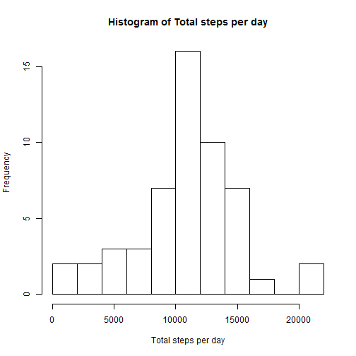
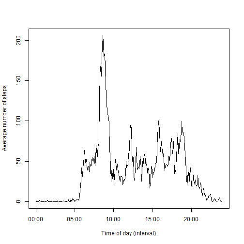
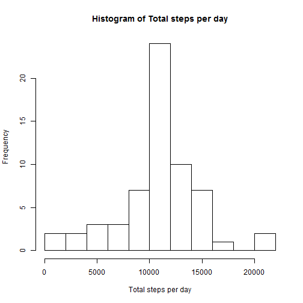
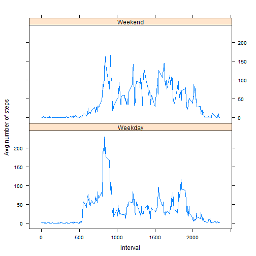

## Introduction
This assignment makes use of data from a personal activity monitoring device which collects data at 5 minute intervals through out the day. The data consists of two months of data from an anonymous individual collected during the months of October and November, 2012 and include the number of steps taken in 5 minute intervals each day.
The dataset is stored in a comma-separated-value (CSV) file and there are a total of 17,568 observations and 3 variables (steps, date and interval) in this dataset.
The data is available from https://d396qusza40orc.cloudfront.net/repdata%2Fdata%2Factivity.zip


## Loading and preprocessing the data

```r
#Verify if the data file exits; if not download the zip file and unzip it
if(!file.exists("activity.csv")) {
        download.file("http://d396qusza40orc.cloudfront.net/repdata%2Fdata%2Factivity.zip",destfile="activity.zip")
        unzip("activity.zip")
}

#load raw data
raw_data<-read.csv("activity.csv")
str(raw_data)
```

```
## 'data.frame':	17568 obs. of  3 variables:
##  $ steps   : int  NA NA NA NA NA NA NA NA NA NA ...
##  $ date    : Factor w/ 61 levels "2012-10-01","2012-10-02",..: 1 1 1 1 1 1 1 1 1 1 ...
##  $ interval: int  0 5 10 15 20 25 30 35 40 45 ...
```

```r
head(raw_data)
```

```
##   steps       date interval
## 1    NA 2012-10-01        0
## 2    NA 2012-10-01        5
## 3    NA 2012-10-01       10
## 4    NA 2012-10-01       15
## 5    NA 2012-10-01       20
## 6    NA 2012-10-01       25
```

```r
#Preprocess the data to remove NAs and format the 'interval' variable
processed_data<-raw_data[complete.cases(raw_data),]
processed_data$interval<-sprintf("%04i",processed_data$interval)
processed_data$interval<-format(processed_data$interval,format="%H%M")
processed_data$interval<-factor(processed_data$interval)

str(processed_data)
```

```
## 'data.frame':	15264 obs. of  3 variables:
##  $ steps   : int  0 0 0 0 0 0 0 0 0 0 ...
##  $ date    : Factor w/ 61 levels "2012-10-01","2012-10-02",..: 2 2 2 2 2 2 2 2 2 2 ...
##  $ interval: Factor w/ 288 levels "0000","0005",..: 1 2 3 4 5 6 7 8 9 10 ...
```

```r
head(processed_data)
```

```
##     steps       date interval
## 289     0 2012-10-02     0000
## 290     0 2012-10-02     0005
## 291     0 2012-10-02     0010
## 292     0 2012-10-02     0015
## 293     0 2012-10-02     0020
## 294     0 2012-10-02     0025
```

## What is mean total number of steps taken per day?

```r
#Total number of steps taken per day
steps_per_day<-tapply(processed_data$steps,processed_data$date,"sum")

#Histogram of total steps per day
hist(steps_per_day,breaks=10, xlab="Total steps per day",main="Histogram of Total steps per day")
```

 

```r
#Mean of total steps per day
sprintf("Mean of total steps per day: %f",mean(steps_per_day,na.rm=T))
```

```
## [1] "Mean of total steps per day: 10766.188679"
```

```r
#Median of total steps per day
sprintf("Median of total steps per day: %f",median(steps_per_day,na.rm=T))
```

```
## [1] "Median of total steps per day: 10765.000000"
```

## What is the average daily activity pattern?

```r
#Average steps per 5-min interval averaged over all days
avg_steps_per_interval<-tapply(processed_data$steps,as.factor(processed_data$interval),mean,na.rm=T)

#Time series plot of average number of steps per interval averaged over all days
plot(strptime(levels(as.factor(processed_data$interval)),format="%H%M"),avg_steps_per_interval,type='l',xlab="Time of day (interval)",ylab="Average number of steps")
```

 

```r
#5-min interval with maximum number of steps (avergaed over all days)
max_interval<-(levels(as.factor(processed_data$interval))[which.max(avg_steps_per_interval)])
max_interval<-format(strptime(max_interval,format="%H%M"),format="%H:%M")
sprintf("Interval with maximum number of steps (averaged over all days): %s",max_interval)
```

```
## [1] "Interval with maximum number of steps (averaged over all days): 08:35"
```


## Imputing missing values

```r
#Calculate and report total number of missing values in the dataset
sprintf("Total number of missing values in the dataset: %d", sum(!complete.cases(raw_data)))
```

```
## [1] "Total number of missing values in the dataset: 2304"
```
### Strategy for imputing missing values
Since data is completely missing for some days, replacing NAs with daily average may be not feasible (since in such cases daily average will be NA); replacing NAs with 5-minute interval average over all days seems more logical

```r
#First add a new variable(column) to the raw dataset that represents the corresponding 5-minute interval average
interpolated_data<-data.frame(raw_data,interval_avg=rep(avg_steps_per_interval,61))
#Next replace NAs with the corresponding 5-muinute interval average
interpolated_data$steps[is.na(interpolated_data$steps)]<-interpolated_data$interval_avg[is.na(interpolated_data$steps)]
#Calculate the total number of steps per day on imputed data and plot the histogram
new_steps_per_day<-tapply(interpolated_data$steps,interpolated_data$date,"sum")
hist(new_steps_per_day,breaks=10, xlab="Total steps per day",main="Histogram of Total steps per day")
```

 

```r
sprintf("New mean of total steps per day: %f",mean(new_steps_per_day,na.rm=T))
```

```
## [1] "New mean of total steps per day: 10766.188679"
```

```r
sprintf("New median of total steps per day: %f",median(new_steps_per_day,na.rm=T))
```

```
## [1] "New median of total steps per day: 10766.188679"
```
The mean value is exactly same as before (which is expected because of the strategy used for imputing NAs) and there is only slight difference in the median.

## Are there differences in activity patterns between weekdays and weekends?

```r
#Create a new factor variable in the dataset with two levels - "weekday" and "weekend" indicating whether a given date is a weekday or weekend day
day<-weekdays(strptime(interpolated_data$date,format="%Y-%m-%d"))
interpolated_data$wend <- as.factor(ifelse(day %in% c("Saturday","Sunday"), "Weekend", "Weekday"))

#Calculate the average number of steps taken per inverval averaged across all weekdays and weekend days
wday_avg_per_interval<-tapply(interpolated_data$steps,list(interpolated_data$interval,interpolated_data$wend),mean,na.rm=T)
#Create a new data frame with weekday and weekend interval averages
newdf<-data.frame(interval=rep(levels(as.factor(processed_data$interval)),2),steps=c(wday_avg_per_interval[,1],wday_avg_per_interval[,2]),day=rep(c("Weekday","Weekend"),each=length(wday_avg_per_interval[,1])))
newdf$interval<-sprintf("%s",levels(newdf$interval))

#load lattice and generate panel plot of the 5-minute interval (x-axis) and the average number of steps taken, averaged across all weekday days or weekend days (y-axis)
library(lattice)
xyplot(steps~as.numeric(interval)|day,data=newdf,layout=c(1,2),type='l',xlab="Interval",ylab="Avg number of steps")
```

 

Clearly there are some similarities and some differences between weekday and weekend patterns. Similarities include, low activity is the early and late intervals of the day as well as peak activity between intervals 800 and 900. One key difference is increased activity during the day-hours during weekend days compared to weekdays.
